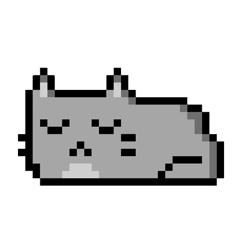

```py
let information = {
  called_name : "Haryns",
  age         : "15",
  pronouns    : [ "he", "him" ],
  fav_theme   : [ "night sky", "blue sky" ],
  fav_color   : 0x0D1116;
}
```

<html>
<head>
  <link rel="stylesheet" type="text/css" href="style.css">
</head>
<body>
  
<h2>I Am Gharyn</h2>


<div align="center">
  <a href="https://github.com/ryo-ma/github-profile-trophy" target="_blank">
    
  </a>

  
</div>

<h4>
  
  
</h4>

<h2 align="center"> My Stats: </h2>

<p align="center">
  <a href="https://github.com/anuraghazra/github-readme-stats" target="_blank">
    
  </a>

  <a href="https://github.com/anuraghazra/github-readme-stats" target="_blank">
    
  </a>
  <br>
</p>

<h2 align="center"> Contributions: </h2>
<div align="center">
  <div>
    <a href="https://git.io/streak-stats" target="_blank">
      
    </a>
  </div>
  <div style="margin-top: 2%;">
    <a href="https://github.com/Ashutosh00710/github-readme-activity-graph" target="_blank">
      
    </a>
  </div>
</div> 

<h2 align="center"> Contact Me: </h2>
  <div align="center">
      <div align="center" class="contact">
      <a href="https://discord.com/channels/@me" target="_blank">
        
      </a>

      <a href="https://www.linkedin.com/in/ananda-gharyn-91141521a/" target="_blank">
        
      </a>

      <a href="https://mail.google.com/mail/u/0/?fs=1&tf=cm&source=mailto&to=persolna1243@gmail.com" target="_blank">
        
      </a>
  </div>
  </div>
</body>
</html>


